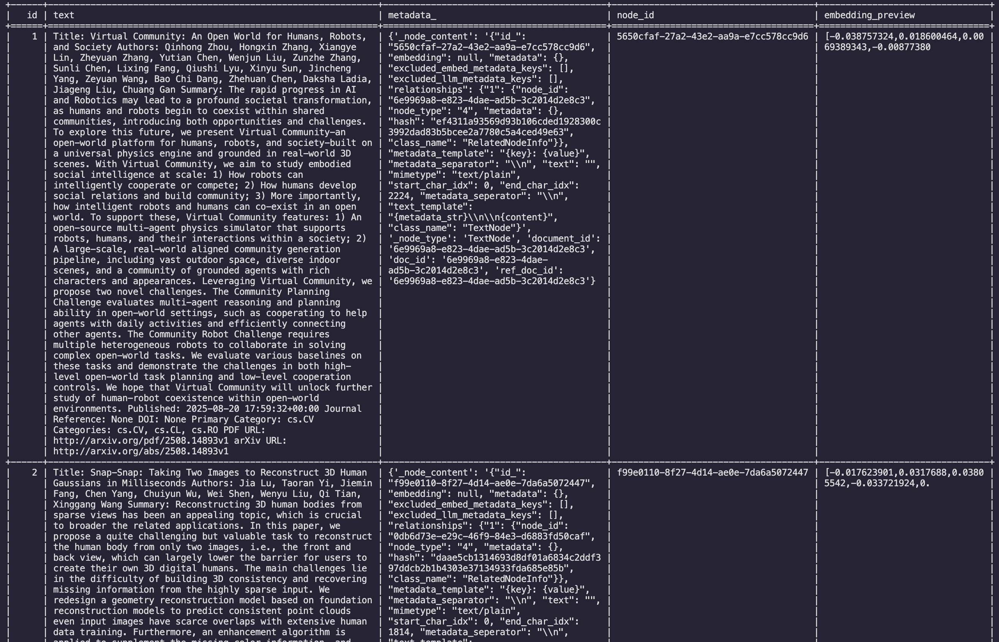

# ArXiv RAG

Architecture:


Screenshot:


### Setup

How to use:
```
cd frontend
npm ci && npm run build
npm run start
```

open separate terminal
```
cd backend
uv pip install -r requirements.txt
uvicorn backend.main:app --host 0.0.0.0 --port 8000 --reload
```

### Backend
**Agents-stuff:**
- build_index.py
- build_query_engine.py 
- run_agent.py

**Database:**
- setup_chat_storage.py
- setup_paper_storage.py
- query_db.py - it can also display the tables in the terminal.

Database setup

The 'arxiv_rag' db contains these tables:
- data_arxiv_papers
- chat_store 
- chat metadata tables




**Endpoint-relevant:**
- main.py - the FastAPI app, mounts /api/chat/
- chat.py - SSE streaming, error handling
- test_agent.py - testing agent

### Frontend
Vite React Typescript and Tailwind app, uses llamaindex's chat-ui


### Limitations
- Using the Mistral model, there is a limit of 1 request per second, which can result in frequent 429 errors. On the backend inside chat.py, a try/except block is used to catch these errors and return a fallback response. No detection is needed on frontend.Need to install llama-index-llms-anthropic for claude support
- UI: the user can't yet manually select refine or standard modes


### Random notes
- Build index stores papers inside index. the important files are docstore.json, where you can roughly estimate how many papers there are.
- Agent searches local RAG index first.
- If NO RELEVANT PAPERS, automatically calls fetch_arxiv_tool to get some new papers. 
- Users can use [refine mode](https://docs.llamaindex.ai/en/stable/module_guides/deploying/query_engine/response_modes/).